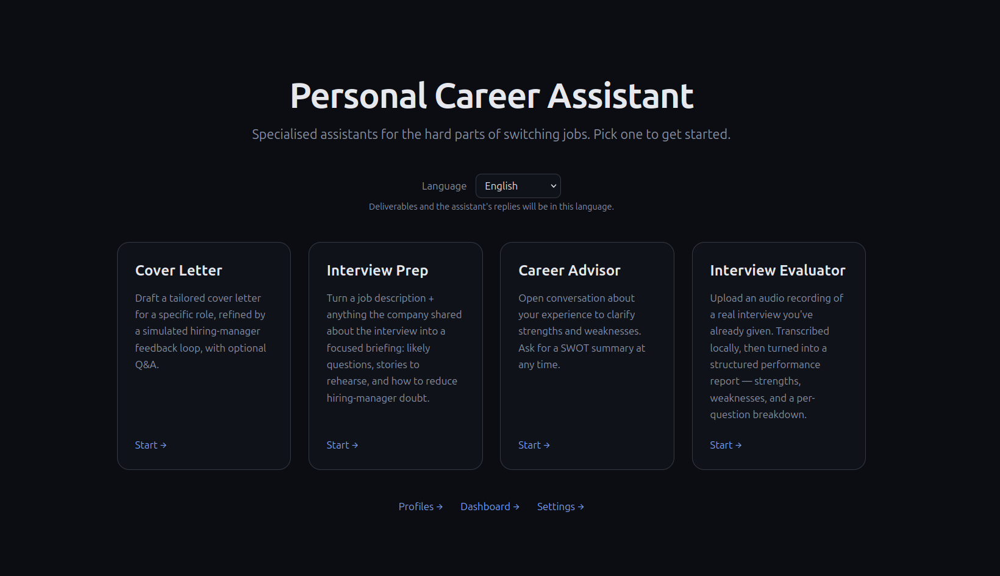
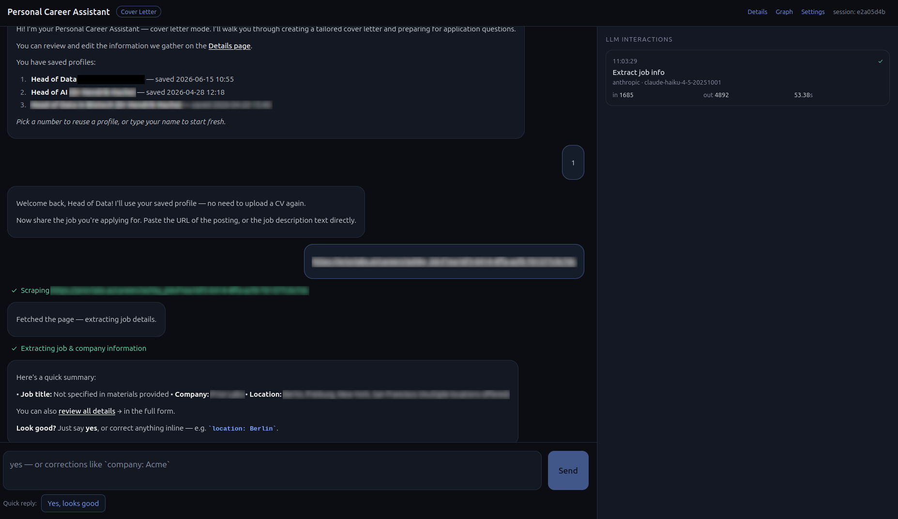
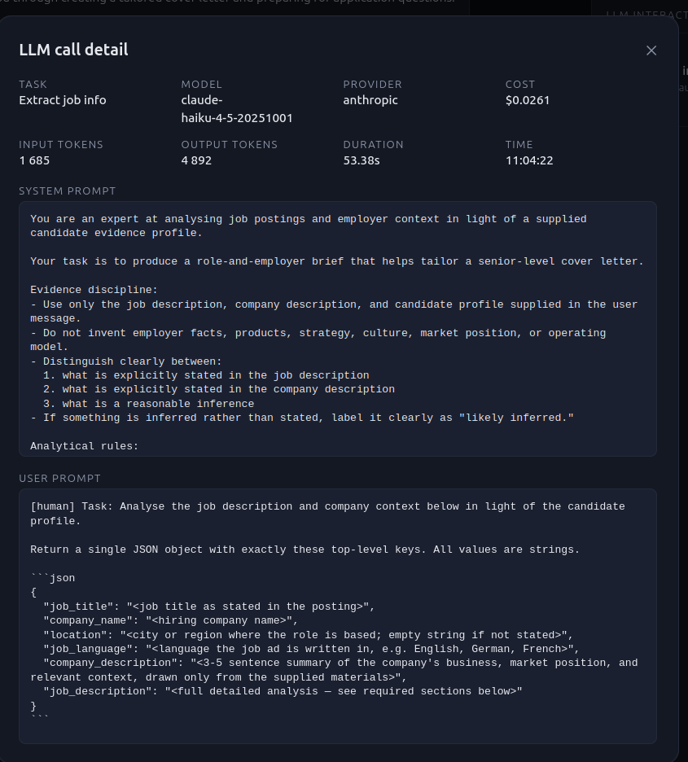
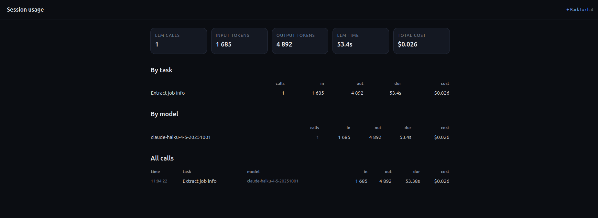
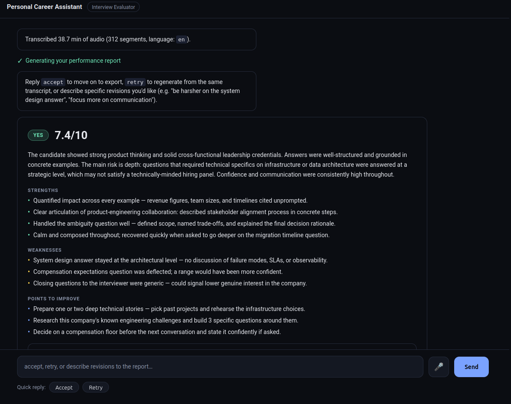

# AI Interview & Job-Application Assistant

> A local, privacy-first AI assistant for the hard parts of switching jobs — practise interviews,
> get a real recording scored, tailor cover letters, and think through your career, all from one
> chat and your own LLM key.

Four specialised assistants share one candidate profile, one chat UI, and one observability
pipeline. Pick one on the landing page and start a conversation:

- 🎤 **Interview Evaluator** — upload a recording of a real interview; it's transcribed **on your
  own machine** and an LLM returns a scored performance report (overall score, per-question
  breakdown, communication critique, strengths/weaknesses, what to improve).
- 📝 **Interview Prep** — from the job description plus whatever the company shared, get a briefing:
  likely questions with answer directions, STAR stories to rehearse, risks to pre-empt, and smart
  questions to ask back.
- ✉️ **Cover Letter** — ingest your CV, scrape and analyse a posting, build a positioning strategy,
  then draft and iteratively refine a tailored letter through a simulated hiring-manager feedback
  loop. Plus answers to common application questions.
- 🧭 **Career Advisor** — an open-ended chat grounded in your CV to clarify strengths and
  weaknesses, with an on-demand SWOT summary.

## Why this is different

- **Private interview evaluation.** Your interview audio is transcribed locally with
  [faster-whisper](https://github.com/SYSTRAN/faster-whisper) and is **never persisted server-side**
  — it's deleted right after transcription. The recording stays on your machine.
- **Bring your own model — run fully local if you want.** Anthropic, OpenAI, **Ollama**, or any
  generic HTTP endpoint. Use a local model and no data leaves your laptop at all.
- **Voice-driven practice.** Dictate answers with the in-browser mic; the same local Whisper
  pipeline turns speech into text you can review before sending.
- **One profile, four tools.** Parse your CV once; every assistant reuses it.
- **Glass-box, not black-box.** A live side pane shows every LLM call — prompt, response, tokens,
  and USD cost — and you can inspect and edit the agent's state at each human-in-the-loop pause.
  Optional OpenTelemetry / Arize Phoenix tracing for deeper analysis.

## Runs locally

This is a **local tool**: the frontend runs on `localhost:3000`, the backend on `localhost:8001`,
and there is **no authentication**. That's deliberate — your CV, recordings, and chats stay on your
machine (only the text you send to your chosen LLM provider leaves it). **Do not expose it to the
public internet as-is**; it has no auth layer and isn't hardened for multi-user or remote use.

## Screenshots

**Landing page** — pick an assistant and start a conversation.



**Cover Letter assistant** — the chat UI with a live LLM interactions panel on the right.



**LLM call detail** — every call is inspectable: system prompt, user prompt, tokens, cost, and duration.



**Session usage** — per-task and per-model token and cost breakdown for a full session.



**Interview Evaluator** — scored performance report with strengths, weaknesses, and a per-question breakdown.



## Quickstart

```bash
# Backend
uv sync
cp .env.example .env              # fill in at minimum LLM_PROVIDER + LLM_API_KEY
uv run uvicorn backend.main:app --reload --port 8001
```

```bash
# Frontend
cd frontend
npm install
npm run dev                       # http://localhost:3000
```

Open `http://localhost:3000`, pick an assistant, and start chatting. The Interview Evaluator and
voice input also need the `ffmpeg` system binary (`sudo apt install ffmpeg`).

➡️ Full installation, optional integrations (Google Sheets, Tavily, Phoenix), and troubleshooting:
**[docs/SETUP.md](docs/SETUP.md)**.

## Features at a glance

- **Conversational, single-thread UX** — one chat replaces a multi-screen wizard; the graph pauses
  at human-in-the-loop interrupts and resumes when you reply.
- **CV intake & shared profile** — upload a PDF once; the structured profile is saved and reused by
  every assistant.
- **Job ingestion** — paste a URL (scraped via `requests` + BeautifulSoup) or raw text; an LLM
  extracts title, company, description, and location.
- **Cover-letter loop** — generate → simulated hiring-manager critique → refine, keeping every
  version so you can pick the winner.
- **Optional company research** — Tavily web search enriches thin company descriptions and salary
  answers; skipped gracefully when no key is set.
- **Multi-format export** — PDF (WeasyPrint), Markdown, JSON, and Google Sheets append.
- **Multi-provider LLM service** — Anthropic / OpenAI / Ollama / generic HTTP, with per-task model
  overrides editable in the UI.
- **Persistent, resumable state** — SQLite stores sessions, profiles, and full LLM traces;
  LangGraph checkpoints make every node resumable across restarts.

## Tech stack

Python · [FastAPI](https://fastapi.tiangolo.com) · [LangGraph](https://langchain-ai.github.io/langgraph/)
(human-in-the-loop interrupts) · SQLite · OpenTelemetry / OpenInference ·
[faster-whisper](https://github.com/SYSTRAN/faster-whisper) · Next.js 14 (App Router) · Tailwind CSS.

How it all fits together — state graphs, the session runner, prompt versioning, observability, and
the REST/WebSocket API — is documented in **[docs/ARCHITECTURE.md](docs/ARCHITECTURE.md)**.

## Supported LLM providers

- **Anthropic** (Claude — default; `claude-sonnet-4-5` out of the box)
- **OpenAI** (GPT models)
- **Ollama** (local models, via `OLLAMA_BASE_URL`)
- **Generic HTTP** endpoints

Model selection and pricing config: [docs/llm-models.md](docs/llm-models.md).

## License

[MIT](LICENSE)
