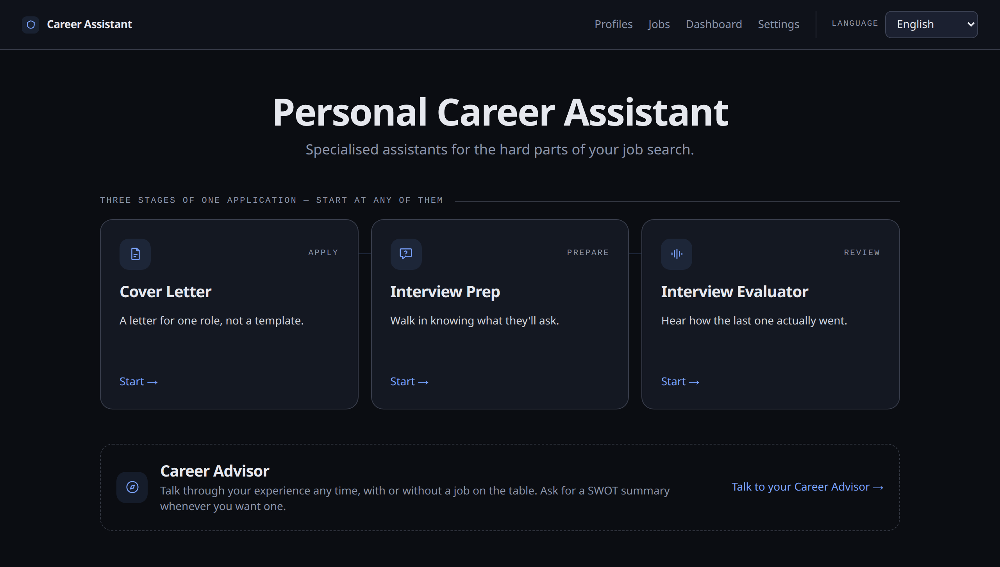
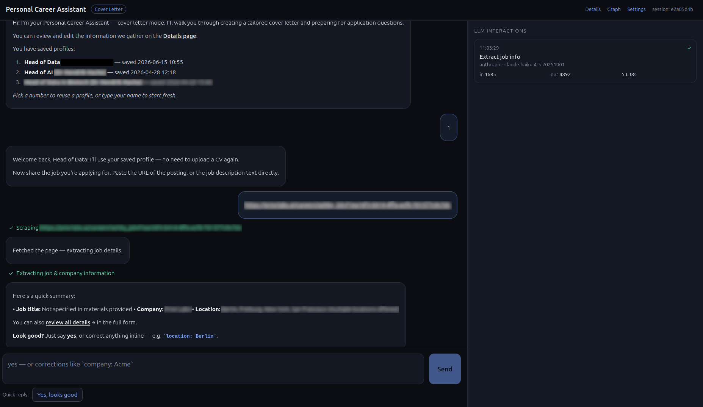
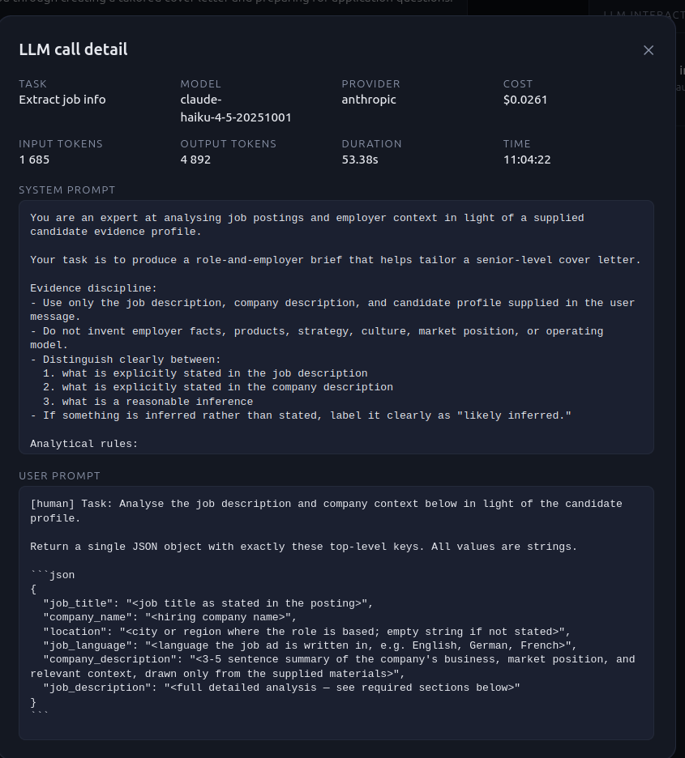
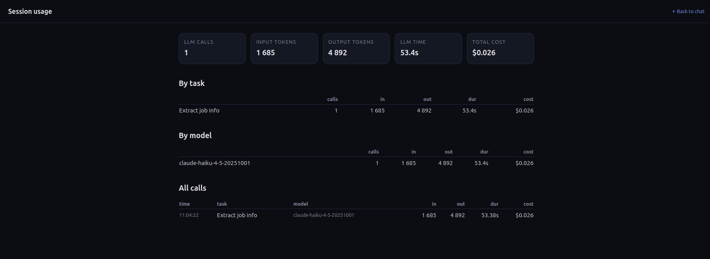
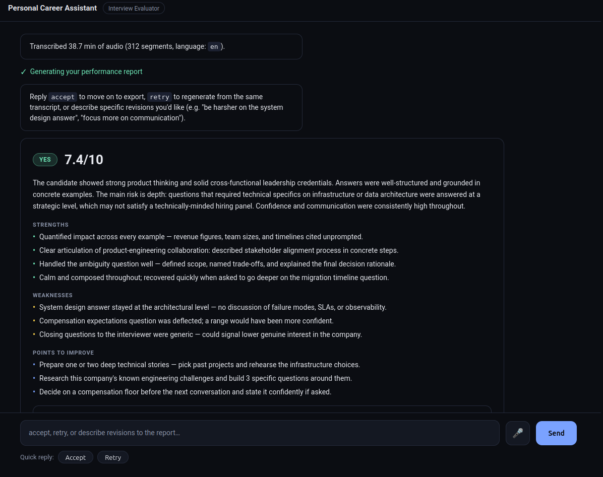

# AI Interview & Job-Application Assistant

> A local, privacy-first AI assistant for the hard parts of your job search — tailor cover letters,
> prepare for interviews, get a real recording scored, and think through your career, all from one
> chat and your own LLM key.

Four specialised assistants share one candidate profile, one chat UI, and one observability
pipeline. The first three follow the arc of a single application — apply, prepare, review — and any
of them can be your starting point. Pick one on the landing page and start a conversation:

- ✉️ **Cover Letter** — ingest your CV, scrape and analyse a posting, build a positioning strategy,
  then draft and iteratively refine a tailored letter through a simulated hiring-manager feedback
  loop. Plus answers to common application questions.
- 📝 **Interview Prep** — from the job description plus whatever the company shared, get a briefing:
  likely questions with answer directions, STAR stories to rehearse, risks to pre-empt, and smart
  questions to ask back. Then keep practising: a mock interview with feedback, classic-question
  drills, technical refreshers, and questions to ask the interviewer.
- 🎤 **Interview Evaluator** — upload a recording of a real interview; it's transcribed **on your
  own machine** and an LLM returns a scored performance report (overall score, per-question
  breakdown, communication critique, strengths/weaknesses, what to improve). It also captures what
  the *interviewer* volunteered outside their questions — team structure, tech stack, priorities,
  next steps — and hands you the full transcript as a downloadable file.
- 🧭 **Career Advisor** — an open-ended chat grounded in your CV to clarify strengths and
  weaknesses, with an on-demand SWOT summary. Available with or without a job on the table.

## Why this is different

- **Private interview evaluation.** Your interview audio is transcribed locally with
  [faster-whisper](https://github.com/SYSTRAN/faster-whisper) and never leaves your machine — no
  cloud speech API is involved. Uploaded recordings are kept in `backend/data/audio/` so a session
  can be resumed without re-uploading; delete that directory when you no longer need them. (Voice
  prompts from the in-browser mic *are* ephemeral — transcribed to a temp file, then deleted.)
- **Bring your own model — run fully local if you want.** Anthropic, OpenAI, **Ollama**, or any
  generic HTTP endpoint. Use a local model and no data leaves your laptop at all.
- **Voice-driven practice.** Dictate answers with the in-browser mic; the same local Whisper
  pipeline turns speech into text you can review before sending.
- **One profile, four tools.** Parse your CV once; every assistant reuses it.
- **Glass-box, not black-box.** A live side pane shows every LLM call — prompt, response, tokens,
  and USD cost — and you can inspect and edit the agent's state at each human-in-the-loop pause.
  Optional OpenTelemetry / Arize Phoenix tracing for deeper analysis.

## Runs locally

This is a **local tool**: the frontend runs on `localhost:3000`, the backend on `localhost:8001`,
and there is **no authentication**. That's deliberate — your CV, recordings, and chats stay on your
machine (only the text you send to your chosen LLM provider leaves it). **Do not expose it to the
public internet as-is**; it has no auth layer and isn't hardened for multi-user or remote use.

## Screenshots

**Landing page** — where the whole search stands, then pick an assistant and start a conversation.



**Cover Letter assistant** — the chat UI with a live LLM interactions panel on the right.



**LLM call detail** — every call is inspectable: system prompt, user prompt, tokens, cost, and duration.



**Session usage** — per-task and per-model token and cost breakdown for a full session.



**Interview Evaluator** — scored performance report with strengths, weaknesses, and a per-question breakdown.



## Quickstart

```bash
# Backend
uv sync
cp .env.example .env              # fill in at minimum LLM_PROVIDER + LLM_API_KEY
uv run uvicorn backend.main:app --reload --port 8001
```

```bash
# Frontend
cd frontend
npm install
npm run dev                       # http://localhost:3000
```

Open `http://localhost:3000`, pick an assistant, and start chatting. The Interview Evaluator and
voice input also need the `ffmpeg` system binary (`sudo apt install ffmpeg`). Archiving a screenshot
of a job posting needs a headless browser (`uv run playwright install chromium`) — `uv sync` installs
the Python package but not the browser itself; without it, scraping still works and the screenshot
is skipped.

**Or with Docker** — backend, frontend, and Phoenix tracing in one command, with no local Python,
Node, or Chromium needed:

```bash
cp .env.example .env              # same minimum as above
docker compose up -d --build      # http://localhost:3000 · Phoenix on http://localhost:6006
```

➡️ Full installation, optional integrations (Google Sheets, Tavily, Phoenix), and troubleshooting:
**[docs/SETUP.md](docs/SETUP.md)**.

## Features at a glance

- **Conversational, single-thread UX** — one chat replaces a multi-screen wizard; the graph pauses
  at human-in-the-loop interrupts and resumes when you reply.
- **CV intake & shared profile** — upload a PDF once; the structured profile is saved and reused by
  every assistant.
- **Job ingestion** — paste a URL (scraped via `requests` + BeautifulSoup) or raw text; an LLM
  extracts title, company, description, and location.
- **Cover-letter loop** — generate → simulated hiring-manager critique → refine, keeping every
  version so you can pick the winner.
- **Job journeys — pick up where you left off** — every job you work on is saved with its artifacts
  (strategy, cover letter, interview briefing, evaluation). A new session offers to continue a saved
  job instead of starting over, and the Applications page lists them all with search, sort, and
  per-artifact dates.
- **The whole search at a glance** — the landing page opens on a breakdown of every application by
  status (applied, in progress, no reply, on hold, offer, rejected, withdrawn), pooled across
  profiles, and each count is a link into that filtered list. Status is derived from the dates on
  the application rather than a field you maintain, so a job you applied to moves itself into "no
  reply" once it has been quiet past your threshold.
- **Interview rounds** — one job usually means several interviews (recruiter, screening, hiring
  manager, technical, panel, final). Each round is tracked separately, so the briefing Interview
  Prep wrote for a round is matched to the recording the Evaluator scores afterwards, and exported
  files are named per round instead of overwriting each other.
- **Learns from your applications** — each finished cover letter updates a per-profile playbook that
  feeds the next one and may propose a profile edit you can approve or reject; accepted interview
  evaluations become coaching insights for your next prep session.
- **Learns from what companies actually told you** — paste the feedback you got with a rejection (or
  an offer) onto the job it belongs to. It shapes the strategy and interview briefing for your next
  applications, and recurring themes are distilled into your playbook. Only what was *said about you*
  is ever used: the outcome itself never teaches the system anything, because a rejection can just as
  easily mean an internal hire or a frozen budget.
- **Tells you where the evaluator was wrong** — when a round has both an AI evaluation and real
  feedback from the company, the job page shows them side by side, and the Interview Evaluator uses
  those pairs to calibrate its next read against how you were actually perceived.
- **A page for everything it has learned** — the Learned page collects the playbook each CV has
  built up, grouped by theme, where you can edit or drop an item. A lesson belongs to the profile
  that earned it; promote one and every profile reads it from the next draft onward. The same page
  asks whether the evaluator is honest — it scores the rounds that advanced against the rounds that
  were rejected, and if it barely separates the two, says so rather than letting you trust it.
- **Optional company research** — Tavily web search enriches thin company descriptions and salary
  answers; skipped gracefully when no key is set.
- **Per-assistant export** — each assistant offers exactly the artifacts it can produce (cover
  letter PDF, application summary, job ad, job-page screenshot, evaluation report, interview
  transcript, briefing, SWOT, LLM traces), picked with multi-select chips. Then choose how to
  receive them: written into the job's application folder, as individual download links, or bundled
  into a zip. Cover-letter sessions can also append a row to your Google Sheet.
- **Optional speaker diarization** — label who said what in an interview transcript (ECAPA
  embeddings + clustering) so the evaluator stops guessing. Off by default; needs
  `uv sync --extra diarization`.
- **Multi-provider LLM service** — Anthropic / OpenAI / Ollama / generic HTTP, with per-task model
  overrides editable in the UI.
- **Persistent, resumable state** — SQLite stores sessions, profiles, job journeys, and full LLM
  traces; LangGraph checkpoints make every node resumable across restarts.
- **Usage dashboard** — aggregate sessions, LLM calls, tokens, and cost per assistant across all
  sessions.

## Tech stack

Python · [FastAPI](https://fastapi.tiangolo.com) · [LangGraph](https://langchain-ai.github.io/langgraph/)
(human-in-the-loop interrupts) · SQLite · OpenTelemetry / OpenInference ·
[faster-whisper](https://github.com/SYSTRAN/faster-whisper) · Next.js 14 (App Router) · Tailwind CSS.

How it all fits together — state graphs, the session runner, prompt versioning, observability, and
the REST/WebSocket API — is documented in **[docs/ARCHITECTURE.md](docs/ARCHITECTURE.md)**.

## Supported LLM providers

- **Anthropic** (Claude — default; `claude-sonnet-5` out of the box)
- **OpenAI** (GPT models)
- **Ollama** (local models, via `OLLAMA_BASE_URL`)
- **Generic HTTP** endpoints

Model selection and pricing config: [docs/llm-models.md](docs/llm-models.md).

## License

[MIT](LICENSE)
