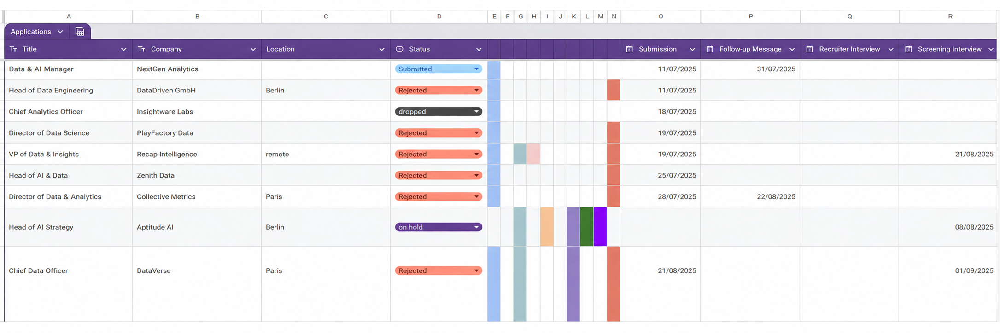

# Setup

Full installation and optional-integration guide. For the 30-second version see the
[README quickstart](../README.md#quickstart).

## Prerequisites

- Python 3.12+
- [`uv`](https://github.com/astral-sh/uv) — the Python package manager this project uses
- Node.js 18+ and npm
- (Optional) `ffmpeg` system binary — required for the Interview Evaluator and voice input
  (`sudo apt install ffmpeg`)
- (Optional) The `diarization` extra for speaker labels on interview transcripts — see
  [Speaker diarization](#speaker-diarization-optional)
- (Optional) A Google Cloud service-account JSON for Google Sheets export
- (Optional) A Tavily API key for web-augmented company research
- (Optional) An OTLP-compatible collector (e.g. Phoenix, Jaeger) to ship spans off-process

## Backend

```bash
uv sync
```

`uv sync` installs runtime + dev dependencies (pytest is in the default group). Use `uv run <cmd>`
for everything Python (`uv run uvicorn …`, `uv run pytest`).

### Speaker diarization (optional)

By default an interview transcript has no speaker labels, and the evaluator infers who said what
from phrasing alone — which works on clear question/answer turns and fails on small talk. Installing
the `diarization` extra labels each segment by voice instead:

```bash
uv sync --extra diarization
```

Then set `transcription.diarize` to `true` in `backend/config/settings.json` and restart the backend.

This pulls torch, torchaudio, speechbrain and scikit-learn — roughly **2.5 GB of wheels** (CUDA
builds on Linux), so it is opt-in. It runs on GPU when one is available and falls back to CPU
otherwise; on a laptop RTX 3050 Ti it adds ~12 s to a 40-minute recording. The speaker-embedding
model (~80 MB) downloads on first use and is cached in `backend/data/models/ecapa/`. Nothing here is
gated behind a HuggingFace token.

If the flag is on but the extra is not installed, transcription still works — you just get
unlabelled segments and an info line in the log.

Create `.env` at the project root — copy the template and fill it in:

```bash
cp .env.example .env
```

At a minimum set `LLM_PROVIDER`, `LLM_MODEL_NAME`, and `LLM_API_KEY`. See `.env.example` for every
supported variable. API keys are read **only** from `.env` — they are never persisted to
`backend/config/settings.json`. Everything else (default model, per-task overrides, model pricing,
language, currency, export folder) lives in `settings.json` and can be edited from the **Settings**
page in the UI.

Run the backend:

```bash
uv run uvicorn backend.main:app --reload --port 8001
```

For verbose logs (request timing, LLM calls):

```bash
JOB_APP_LOG_LEVEL=DEBUG uv run uvicorn backend.main:app --reload --port 8001
```

Run tests:

```bash
uv run pytest
```

## Frontend

```bash
cd frontend
npm install
npm run dev
```

The dev server runs on `http://localhost:3000` and talks to the backend on `127.0.0.1:8001` via
REST + a WebSocket per session.

## Docker (alternative)

Instead of the Backend and Frontend steps above, you can run the whole stack in containers. The only
prerequisite is Docker with Compose v2. The images bundle everything else: Python, Node, WeasyPrint's
system libraries, and the Playwright Chromium browser.

```bash
cp .env.example .env              # fill in at minimum LLM_PROVIDER + LLM_API_KEY
docker compose up -d --build
```

| Service    | URL                     | Notes                                                        |
|------------|-------------------------|--------------------------------------------------------------|
| `frontend` | `http://localhost:3000` | Proxies `/api` and `/media` to the backend                   |
| `backend`  | `http://localhost:8001` | Must be published: the browser opens its WebSocket directly  |
| `phoenix`  | `http://localhost:6006` | Tracing; the backend is pointed at it automatically          |
| `ollama`   | `http://localhost:11434`| Only with `docker compose --profile ollama up -d`            |

The containers use the same ports as the local dev servers, so stop those (and any standalone
`phoenix` container) first.

**Where things live:**

- **Secrets** are read from `.env`. Compose overrides the host-specific values for you: the export
  folder, the Ollama and Phoenix addresses, and the Google credentials path.
- **Database, CVs, recordings, screenshots** are stored in the `app-data` volume, not in your local
  `backend/data/`. To bring existing data over, copy it in once:
  `docker compose cp backend/data/. backend:/app/backend/data/` (then `docker compose restart backend`).
- **Settings**: `backend/config/` is bind-mounted, so edits on the Settings page land in the
  repo's `settings.json` just as they do locally.
- **Exports** are written to `$EXPORT_DIR` on the host (default `~/JobApplications/Applications`).
- **Google Sheets**: the file at `GOOGLE_SHEETS_CREDENTIALS_PATH` in `.env` is mounted read-only
  into the container.
- **Whisper models** download on first transcription and are cached in the `whisper-models` volume.

**Build options** (set in `.env` or the shell):

- `WITH_DIARIZATION=true` builds in the [speaker-diarization](#speaker-diarization-optional) extra
  (~2.5 GB). You still need to enable `transcription.diarize` in settings.
- `DOCKER_OLLAMA_BASE_URL=http://host.docker.internal:11434` uses an Ollama running on the host
  instead of the `ollama` container.
- `UID` / `GID` (default 1000) set the container user, so files written to the bind mounts are owned
  by you.

After pulling new code, run `docker compose up -d --build` again. Watch the logs with
`docker compose logs -f backend`.

## Choosing an LLM provider

Set `LLM_PROVIDER` to one of `anthropic`, `openai`, `ollama`, or `http`. For per-task model
overrides and pricing, see [llm-models.md](llm-models.md). To run fully locally with no cloud
provider, use `ollama` and point `OLLAMA_BASE_URL` at your Ollama server.

## Google Sheets export (optional)

The app appends a row per application to a spreadsheet you own. A ready-made template is included at
`docs/Job Applications - Template.xlsx` — import it into Google Sheets (File → Import) to get the
correct column layout out of the box.

The sheet tracks one application per row with columns for job title, company, location, and status,
followed by date columns for each stage in the pipeline: Submission, Follow-up Message, Recruiter
Interview, Screening Interview, Hiring Manager Interview, Technical Interview, Leadership Interview,
Case Study, Case Study Presentation, On Hold, and Rejection. A visual timeline of coloured blocks
makes it easy to scan pipeline progress at a glance.



**Setup:**

1. Create a Google Cloud project and enable the Google Sheets API.
2. Create a service account, generate a JSON key, and store it locally.
3. Share your target spreadsheet with the service-account email (Editor).
4. Set `GOOGLE_SHEETS_SPREADSHEET_ID` and `GOOGLE_SHEETS_CREDENTIALS_PATH` in `.env`.

The app authorises with the `https://www.googleapis.com/auth/spreadsheets` scope via `gspread`.

## Tavily web search (optional)

Tavily provides the live web-search results used by two nodes:

- **`research_company`** — when the extracted company description is thin (< ~200 chars), it queries
  Tavily for company background and asks an LLM to synthesise a 3–5 paragraph profile. Wired into
  the cover-letter and interview-prep graphs.
- **`qa_answer`** — salary questions trigger a Tavily query for market benchmarks before the LLM
  drafts the answer.

Setup:

1. Sign up at [tavily.com](https://tavily.com) and grab an API key (the free tier is plenty for
   development).
2. Add `TAVILY_API_KEY=tvly-...` to `.env`.
3. Restart the backend.

If the key is missing, both nodes degrade gracefully — the assistant skips the web search and works
with whatever context it already has. No code changes needed either way.

## Phoenix tracing (optional)

[Arize Phoenix](https://github.com/Arize-ai/phoenix) is a local LLM-observability UI that ingests
OpenTelemetry spans. With Phoenix running, every `call_llm` shows up as a trace with full prompt,
response, tokens, latency, and session tag — useful when debugging prompts or comparing models.

**You don't need Phoenix to see LLM activity** — the assistant's own right-hand pane already shows
every call per session via the in-process event bus. Phoenix is only worth installing for
cross-session analysis, historical comparison, or OTel-native exploration.

**Recommended: run Phoenix in Docker.** The PyPI packages currently have version mismatches between
`arize-phoenix` and `arize-phoenix-evals` that break `phoenix serve`. Docker avoids the problem —
the image bundles a known-good combination. (If you use the [Docker setup](#docker-alternative),
Phoenix is already included and wired up. Skip the rest of this section.)

```bash
docker run -d --name phoenix \
  -p 6006:6006 -p 4317:4317 \
  -v phoenix-data:/root/.phoenix \
  arizephoenix/phoenix:latest
```

Then add to `.env`:

```bash
PHOENIX_COLLECTOR_ENDPOINT=http://localhost:6006/v1/traces
```

Restart the backend (`init_otel()` reads the env var at startup), trigger one LLM call from the UI,
and open `http://localhost:6006`. Spans are grouped by `session:{id}` — OpenInference's LangChain
instrumentation attaches that tag automatically via `backend/llm/service.py`.

Useful Docker commands:

```bash
docker logs -f phoenix          # watch startup
docker stop phoenix             # pause (data persists in the phoenix-data volume)
docker start phoenix            # resume
docker rm -f phoenix            # remove container (volume survives)
docker volume rm phoenix-data   # wipe all traces
```

If the env var is unset, tracing still runs in-process and feeds the UI cards — nothing is exported
off-process and Phoenix is not required for normal operation.
